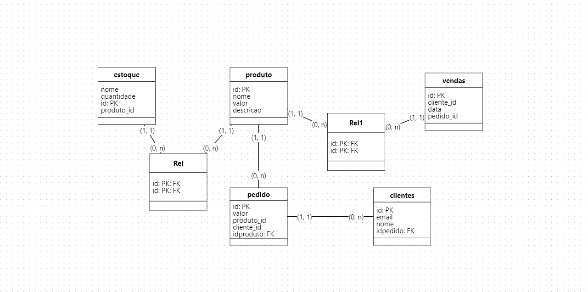

# Ecommerce backend



---

# Indice

  - [Sobre](#-sobre)
  - [Tecnologias utilizadas](#-tecnologias-utilizadas)
  - [Como baixar o projeto](#-como-baixar-o-projeto)

---

## 📑 Sobre

Este é o backend de um ecommerce

---

## 🚀 Tecnologias utilizadas

o projeto foi desenvolvido utilizando as seguintes tecnologias

- [node](https://nodejs.org/)
- [express](https://expressjs.com/)
- [mongodb](https://www.mongodb.com/)

---

## 📁 Como baixar o projeto

```bash

# Clonar o repositório
$ git clone https://github.com/Leandro-Pinho/server

# Entrar no diretório
$ cd server

# Instalar as dependências
$ npm install

# Iniciar o projeto
$ npm run dev


```

Desenvolvido ❤️ por Leandro Pinho
